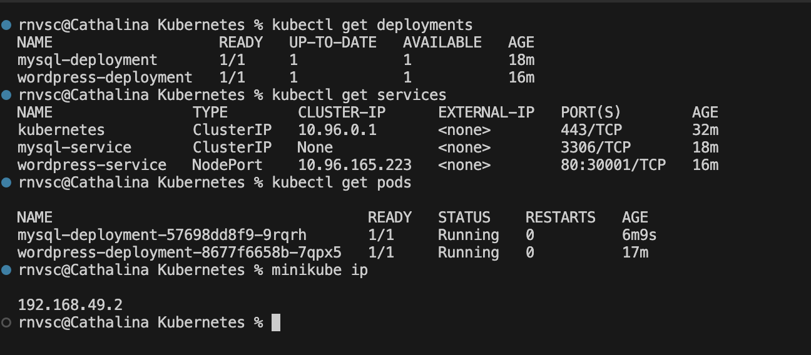

# Déploiement de WordPress sur Kubernetes avec Minikube

Ce projet a pour objectif de déployer une application WordPress sur un cluster Kubernetes local, en utilisant Minikube. 
Le déploiement se fait à l'aide de manifests YAML, sans Helm, pour mieux comprendre la mise en place d'une application dans Kubernetes.

## Prérequis

- [Minikube](https://minikube.sigs.k8s.io/docs/) installé et configuré
- [kubectl](https://kubernetes.io/docs/tasks/tools/install-kubectl/) installé
- [Docker](https://www.docker.com/) pour l'exécution de containers (facultatif, mais utile pour les tests locaux)
- Un terminal pour exécuter les commandes

## Étapes du projet

Le déploiement de WordPress est divisé en plusieurs étapes :

### 1. Démarrer Minikube

Commencez par lancer un cluster Minikube local.

```bash
minikube start
```

### 2. Créer un Secret pour le mot de passe MySQL

Nous utilisons un `Secret` pour stocker en toute sécurité le mot de passe de l'utilisateur root de la base de données MySQL. Créez le secret avec le mot de passe encodé en base64.

```bash
kubectl apply -f mysql-secret.yaml
```

### 3. Déployer MySQL

MySQL est déployé avec un seul replica. Le mot de passe root est récupéré à partir du secret créé dans l'étape précédente. Le service expose MySQL à l'intérieur du cluster.

```bash
kubectl apply -f mysql-deployment.yaml
kubectl apply -f mysql-service.yaml
```

### 4. Créer un Volume Persistant pour WordPress

Un `PersistentVolumeClaim` est utilisé pour stocker les données de WordPress de manière persistante. Cela permet à WordPress de conserver les données même après la suppression des pods.

```bash
kubectl apply -f wordpress-pvc.yaml
```

### 5. Déployer WordPress

WordPress est déployé avec un seul replica. Le mot de passe de la base de données est récupéré à partir du secret MySQL. Un volume persistant est monté pour stocker les données de WordPress.

```bash
kubectl apply -f wordpress-deployment.yaml
kubectl apply -f wordpress-service.yaml
```

### 6. Accéder à l'application WordPress

Une fois les déploiements effectués, vous pouvez accéder à l'interface WordPress en utilisant Minikube. Exécutez la commande suivante pour obtenir l'URL de l'application :

```bash
minikube service wordpress-service --url
```

Cette URL vous permettra d'accéder à votre site WordPress local.



## Structure du projet

Le projet est constitué des fichiers suivants :

- `mysql-secret.yaml`: Création d'un secret Kubernetes pour le mot de passe MySQL.
- `mysql-deployment.yaml`: Déploiement de MySQL avec un seul replica et utilisation du secret pour le mot de passe.
- `mysql-service.yaml`: Exposition de MySQL en tant que service `ClusterIP`.
- `wordpress-pvc.yaml`: Définition d'un `PersistentVolumeClaim` pour stocker les données de WordPress.
- `wordpress-deployment.yaml`: Déploiement de WordPress avec connexion à la base de données MySQL et utilisation d'un volume persistant.
- `wordpress-service.yaml`: Exposition de WordPress via un service `NodePort`.

## Résumé

Ce projet vous permet de comprendre comment déployer une application (WordPress) avec une base de données (MySQL) sur Kubernetes en utilisant des manifests YAML. Vous apprendrez à sécuriser les informations sensibles (comme le mot de passe MySQL) avec des `Secrets`, à utiliser des volumes persistants pour stocker les données, et à exposer les services au sein du cluster.


